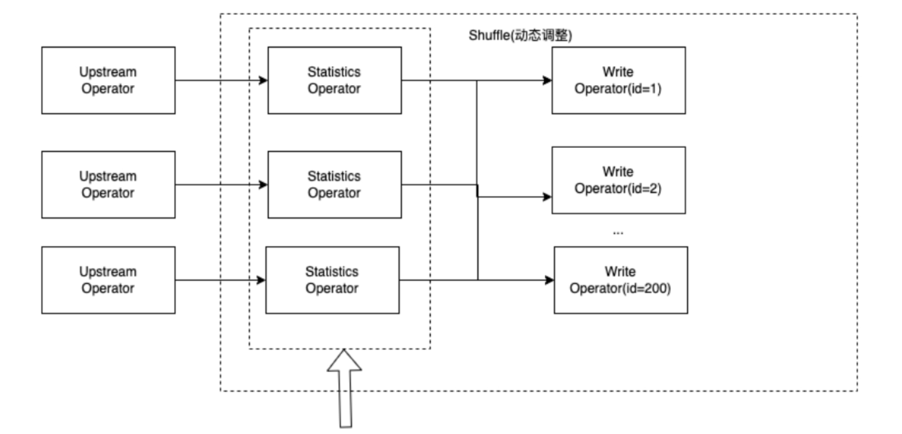

# 作者介绍

胡源峰: [[一段自我介绍]]

# 摘要

本文主要介绍了虎牙基于 Apache Iceberg 在实时数据湖构建方面的实践经验。

[[一段话介绍虎牙情况]]

本文将主要介绍虎牙基于 Apache Iceberg 在实时报分析和离线链路实效性提升两个场景下的实践。


# 实时分析场景

  
1. **基于 Apache Iceberg 构建实时分析数仓的背景**

虎牙通过数据分析平台提供面向数据分析师的 Trino SQL 查询服务，以满足BI报表或Adhoc查询的需求。 
分析师在使用数据前需要将数据源注册到数据分析平台，通常是来自日志采集平台的产生的某个 Kafka Topic, 
然后数据分析平台会自动维护一个 Flink 传输任务将数据导入对 Trino 查询的存储系统中。

在接入 Iceberg 之前，对于实时性要求不高的情况通常是使用 Hive ，而对于实效性要求比较高的场景，会使用 Clickhouse 集群作为实时数仓。

不过在实际生产环境下使用 Clickhouse 作为实时数仓并不能满足虎牙近实时分析的需求，主要是因为在实时分析场景中，源端表一般都是明细表，数据量非常庞大，而对于 Clickhouse 这种存储计算一体的架构，在遇到大表的访问时，很容易出现集群不可用。甚至可能因为某个分析师执行了一个大SQL，导致整个集群的实时数据入仓出现问题。

为了提升可用性，虎牙决定使用基于数据湖技术，构建存算分离架构的实时分析数仓。在众多数据湖方案中，虎牙最终选择了 Apache Iceberg, 在使用存算分离的架构后，系统整体的稳定性得到了比较好的提升，不再会出现因为某个查询SQL而导致数据无法入湖的情况发生。


2. **利用 Doris 对热点数据加速**

虽然 Apache Iceberg 带来了稳定性上的提升，但是对于报表或分析场景，查询的响应速度也很关键。由于分享场景大多都是日志数据，热点数据集中在最近几个分区，在这种业务场景下，虎牙数据分析平台提供了基于 Doris 的热点数据查询加速的能力。

上游数据在入湖过程中，Flink 入湖任务也会同步的将数据写入 Doris 引擎中，然而与之前直接使用 CK 做查询引擎不同，这里引入 Doris 只会将数据保留较短的时间，并且会周期性的淘汰比较久远的信息。同时 Flink 任务会在每个分区完成时生成 PartitionEvent 并同步到虎牙自研的元数据服务。元数据服务中记录了 Doris 中保留的热点数据的分区信息。


同时改写了 Trino 查询引擎的执行计划，用户查询时会先访问元数据服务，拿到对应的表在 Doris 和 Iceberg 的分析信息，通过物化查询器的重写，将最近一段时间的插件直接命中 Doris ， 对于 Doris 中已经删除的分区会命中到 Iceberg 表上。这样对于近实时的查询可以获得更好的查询性能。

3. **重写 FileIO 进行 alluxio 加速**

通过引入 Doris 解决了大部分较近数据的查询响应需求，然而仍然有部分对查询需求要求 Iceberg 表也有较高的查询响应需求。对于这部分表，数据分析平台自己搭建了 Alluxio 集群对查询进行加速。

由于 Alluxio 集群只在查询加速时才开启，所以并没有使用 Hadoop 集成 Alluxio 的方式使用，对于数据入湖过程中，仍然以 `hdfs://` 的文件路径写入数据文件。为了可以根据需求动态的选择 Alluxio 查询加速，虎牙在 Trino 的 Iceberg FileIO 进行了封装，通过表上的参数，在读取文件时将文件路径重定向到 Alluxio 集群。

```sql
alter table iceberg.xxx.xxx set tblproperties ('read.datafile.alluxio.enable' = 'true');
```

这样 Trino 引擎就可以根据需要选择访问 Hadoop 或 Alluxio 集群访问数据文件了。


4. **引入 Amoro 对 Iceberg 表进行持续优化**

为了保证实效性，虎牙采用的是 Flink 实时写入 Iceberg 表的方案，在这种场景下 Flink 写入 Iceberg 表会产生大量的小文件。文件的碎片化对查询性能产生了较大的影响，因此需要定期对 Iceberg 表进行重写以合并小文件。

最开始虎牙采用的是通过 Spark 定时任务周期性的调度 Iceberg 原生的 `rewrite_data_files` 存储过程实现的，然而当部分业务开始尝试接入 CDC 数据时，这种方案却并不能达到预期的效果。一方面 CDC 场景下 Flink Sink 端会产生大量的 Equality-Delete 文件，引擎端在读取带有 Equality-Delete 文件的表时需要将关联的 Equality-Delete 文件缓存到内存中，如果合并任务没有及时合并导致 Equality-Delete 文件堆积，会对查询端产生非常大的影响，甚至引起引擎端 OOM。 另一方面，CDC 场景下的合并任务调度也更加复杂，在日志场景下，数据只会写入最新的分区，因此合并任务只需要合并最新产生的分区即可，但是在 CDC 场景下，更新可能发生在历史分区，合并任务需要根据文件的写入情况评估哪些分区需要合并，这大大提高了合并任务的维护难度。

基于以上问题，虎牙开始调研是否有成熟的方案可以及时发现碎片文件多的表并且及时地去对这些表进行合并，此时刚好 Amoro 项目开源，虎牙便测试了使用 Amoro 对 Iceberg 表进行优化的场景。

Amoro 采用了基于文件统计信息触发的合并任务调度，这使得相比原来采用 Spark 定时任务做周期性调度，Amoro 的调度周期可以更及时，开销更小。 这不仅仅可以用于解决虎牙 CDC 表治理的问题，对于基于 Iceberg 的日志表同样有很好的优化效果，基本上实现了数据入湖后分钟级延迟的数据合并，大大提高了 OLAP 分析查询效率。

通过以上3种方式对 Iceberg 表查询的进一步优化，几乎得到了和 OLAP 引擎一样的查询体验。


# 近实时数据处理场景

**1. 业务背景**

虎牙的离线批处理链路是基于 Hive + Spark 的方案，采用的是小时级的分区以提升离线计算的实效性，然而这套方案还是存在一些问题：

1. 对 Hive Meta Database 压力大: 由于是小时级分区，导致分区数量非常庞大，在分区数比较多的查询中对 MySQL 服务的压力很大，对系统整体的可用性会带来较大的风险。
2. 没有 File Skippping 能力: Hive 只能做到分区级别的文件过滤，实际查询中还是会读取很多不需要的文件，对整体计算任务的性能影响比较大。
3. 任务调度困难: 为了提高计算的实效性，我们期望数据到达后立即调度，但是 Hive 目前的元数据很难支持判定一个分区的数据是否全部到达。
4. 实效性达不到要求: 由于调度触发以及计算性能的问题，即使使用了小时级别的分区，后续的分析任务执行完成时，延迟已经超过1小时很久了。

**2. 基于 Watermark 的 Iceberg 近实时调度**

上述问题的核心还是实效性，虎牙通过将 ODS/DWD 层从 Hive 表替换为 Iceberg 表以解决上述问题。在替换为 Iceberg 表以后，虎牙将任务调度的周期从1小时一次改为了10分钟一次。

由于 Iceberg 有很强的 File Skipping 能力，而且通过时间过滤后，每次参与计算的文件数量大大减少了，这不仅提高了计算效率，并且由于调度周期的提升，使得最终产出数据的实效性得到了提升。

另外通过对 Flink Iceberg Sink 进行改造，使得每次提交时，将当前数据的 watermark 记录到 Snapshot sammary 中.


这样任务调度系统即可依据 SQL 查询 Iceberg 元数据表决定是否开始进行计算任务的调度。

```sql
SELECT 
assert_true(date_format(from_unixtime(max(summary['flink.watermark'])/1000),'yyyy-MM-dd HH:mm:ss') > 'xxx')
FROM iceberg.xxx.xxx.snapshots;
```
 

# Iceberg 使用过程中的优化

**1. Flink 写入过程中数据倾斜问题处理**

在以上两个使用 Iceberg 的场景中，均使用 Flink 完成数据入湖。在使用 Flink 写入 Iceberg 的过程中，由于源端数据分布问题，导致出数据倾斜。

比如在表中定义三个分区字段 `day` `hour` 和 `type`， 通过 Flink 实时写入 Iceberg ， Iceberg 提供 `distribution-mode` 为 `none` 或者 `hash`，如果是 `none` 的话在`flink`到 `writer` 是散发过去的，每个 `writer` 都会至少生成 `type` 总类型数量文件，如果 `type` 一共有50种，写入并行度为200，那么在一次checkpoint中至少生成 50 * 200 个文件，这会导致产生非常多的 io 链接，commit的时候也不稳定。如果使用`hash`，可以减少文件的生成，但是如果某一个 `type` 的值特别大，就会导致这个`type` 值全部发往一个writer，这样就会导致数据倾斜,在写入的时候吞吐量就不够了，而且会有严重的反压。


虎牙的解决方案是通过 在 `Flink writer` 算子之前添加一个统计算子以及 `Custom Partition` 实现的。 


通过对 `flink RowData` 做一层包装, 在数据中加入自定义的分区号：

```java
public class RowDataWrap implements RowData {
  private RowData rowData;
  private int partition;

  public RowData getRowData() {
    return rowData;
  }

  public RowDataWrap setRowData(RowData rowData) {
    this.rowData = rowData;
    return this;
  }

  public int getPartition() {
    return partition;
  }

  public RowDataWrap setPartition(int partition) {
    this.partition = partition;
    return this;
  }
```

在 `Flink writer` 算子之前添加一个统计算子用于收集本次 `checkpoint` 中各个 `type` 类型所占此区间内的比例, 在 checkpoint 之后作为算子状态存储，比如:


```
type_a:12%, type_b:30%, type_c:0.5%.....
```


然后在下一个checkpoint区间，再计算出行数据需要发往的 `partition num`，比如上述如果有200个写入并行度，那么 `type_a` 的数据就会被发送到 `0~23` 号写入 partition 写入。




最终能在既能保证写入效率的情况下，文件数量也能控制在一个合理值。


如图，每个写入task的写入数据量都几乎相等，这解决了日志入湖场景下的大难题，有了type分区，下游也能更好的利用 `iceberg` 的 `file skipping` 能力.

当然 Iceberg 社区也有一个 project 在跟进这块 ，有兴趣也可以关注一下： <https://github.com/apache/iceberg/projects/27>


**2. 基于 Amoro 管理并监控 Iceberg 表**

虎牙是在 Iceberg 实时分析场景下，为解决 Iceberg 表小文件合并问题引入 Amoro 的，然而接入 Amoro 后发现其可以提供不止于 Iceberg 表在线合并的能力。目前 Amoro 已经成为了虎牙 Iceberg 表的在线管理监控平台。

1. Iceberg 表快照自动过期

在 Iceberg 原生提供的能力中，快照的过期需要通过 Spark 任务触发。而 Amoro 集成了快照管理的能力，通过对表上设置 properties 即可自动化的过期历史快照。

2. Iceberg 表孤儿文件治理

在任务写入 Iceberg 过程中，由于提交失败或者 Failover 等原因可能产生一些孤儿文件，这些文件不被访问到但是占据存储空间。在 Iceberg 原生提供的能力中，孤儿文件清理需要通过 Spark 任务触发，而 Amoro 同样集成了孤儿文件治理的能力，只需要设置表上对应的 properties 即可自动发现并删除孤儿文件。

3. Iceberg 表元信息展示以及DDL执行

不同于 Hive 等传统大数据表，Iceberg 表除了列信息外，还有一些额外的元信息比如 Snapshot 记录。并且 Iceberg 表在 Hive 上并不会注册分区信息，因此这些 Iceberg 的元信息无法在一些与 Hive 集成的可视化平台中展示。Amoro 提供了 Iceberg 元信息展示页面，使得虎牙的系统管理者可以通过 Amoro 比较轻松的查看 Iceberg 表的元信息。同时也会使用 Amoro 提供的 Terminal SQL 入口执行一些管理性 DDL。

4. 基于 Amoro 二次开发元数据监控。

由于 Amoro 是基于表的快照信息触发 Optimizing 任务，这使得 Amoro 会持续维护 Iceberg 的快照统计信息。虎牙数据团队基于 Amoro 二次开发了 Iceberg 表的监控告警，在 Amoro 刷新 Iceberg 的元数据后，可以根据自定义的规则触发告警。

目前虎牙线上所有 Iceberg 表均接入了 Amoro, 其中除去离线数据加工链路的统一采用 Spark 进行数据优化外， 所有 Flink 实时分析场景的 Iceberg 表均通过 Amoro 进行持续优化。

# 未来规划

目前虎牙和 Amoro 社区保持着紧密联系，积极参与到 Amoro 社区的多个核心功能开发中。目前正在推进 Amoro 监控告警功能的开发中，会将目前公司内的实践贡献给社区。另外在参与 Amoro 对 Iceberg 表 Tag & Branch 相关功能的推进。

另外虎牙也在探索 Paimon 在 CDC 场景下的应用，并且尝试使用 Amoro 集成管理 Paimon 表，期待未来给大家带来更多实践。


