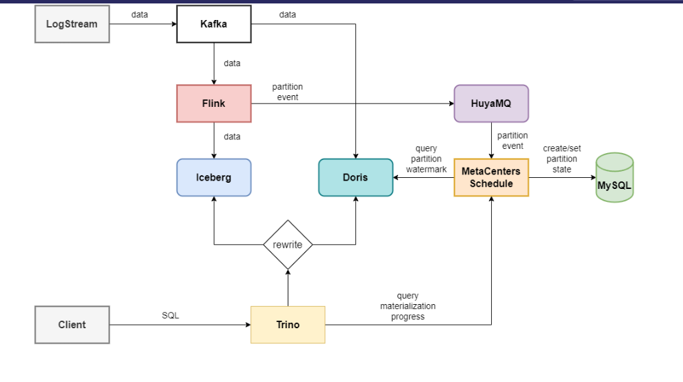

# 摘要

本文主要介绍了虎牙基于 Apache Iceberg 以及 Amoro 在数据湖构建方面的实践经验。

[[一段话介绍虎牙情况]]

本文将主要介绍虎牙基于 Apache Iceberg 在实时报表/Adhoc查询和离线链路实效性提升两个场景下的实践。

# 实时报表/Adhoc查询场景

  
1. **基于 Apache Iceberg 构建实时分析数仓的背景**

虎牙通过数据分析平台提供面向数据分析师的 Trino SQL 查询服务，以满足BI报表或Adhoc查询的需求。 
分析师在使用数据前需要将数据源注册到数据分析平台，通常是来自日志采集平台的产生的某个 Kafka Topic, 
然后数据分析平台会自动维护一个 Flink 传输任务将数据导入对 Trino 查询的存储系统中。

在接入 Iceberg 之前，对于实时性要求不高的情况通常是使用 Hive ，而对于实效性要求比较高的场景，会使用 Clickhouse 集群作为实时数仓。

不过在实际生产环境下使用 Clickhouse 作为实时数仓并不能满足虎牙近实时分析的需求，主要是因为在实时分析场景中，源端表一般都是明细表，数据量非常庞大，而对于 Clickhouse 这种存储计算一体的架构，在遇到大表的访问时，很容易出现集群不可用。甚至可能因为某个分析师执行了一个大SQL，导致整个集群的实时数据入仓出现问题。

为了提升可用性，虎牙决定使用基于数据湖技术，构建存算分离架构的实时分析数仓。在众多数据湖方案中，虎牙最终选择了 Apache Iceberg, 在使用存算分离的架构后，系统整体的稳定性得到了比较好的提升，不再会出现因为某个查询SQL而导致数据无法入湖的情况发生。


2. **利用 Doris 对热点数据加速**

虽然 Apache Iceberg 带来了稳定性上的提升，但是对于报表或分析场景，查询的响应速度也很关键。由于分享场景大多都是日志数据，热点数据集中在最近几个分区，在这种业务场景下，虎牙数据分析平台提供了基于 Doris 的热点数据查询加速的能力。

上游数据在入湖过程中，Flink 入湖任务也会同步的将数据写入 Doris 引擎中，然而与之前直接使用 CK 做查询引擎不同，这里引入 Doris 只会将数据保留较短的时间，并且会周期性的淘汰比较久远的信息。同时 Flink 任务会在每个分区完成时生成 PartitionEvent 并同步到虎牙自研的元数据服务。元数据服务中记录了 Doris 中保留的热点数据的分区信息。



同时改写了 Trino 查询引擎的执行计划，用户查询时会先访问元数据服务，拿到对应的表在 Doris 和 Iceberg 的分析信息，通过物化查询器的重写，将最近一段时间的插件直接命中 Doris ， 对于 Doris 中已经删除的分区会命中到 Iceberg 表上。这样对于近实时的查询可以获得更好的查询性能。

3. **重新 FileIO 进行 alluxio加速**

通过引入 Doris 解决了大部分较近数据的查询响应需求，然而仍然有部分对查询需求要求 Iceberg 表也有较高的查询响应需求。对于这部分表，数据分析平台自己搭建了 Alluxio 集群对查询进行加速。

由于 Alluxio 集群只在查询加速时才开启，所以并没有使用 Hadoop 集成 Alluxio 的方式使用，对于数据入湖过程中，仍然以 `hdfs://` 的文件路径写入数据文件。为了可以根据需求动态的选择 Alluxio 查询加速，虎牙在 Trino 的 Iceberg FileIO 进行了封装，通过表上的参数，在读取文件时将文件路径重定向到 Alluxio 集群。

```sql
alter table iceberg.xxx.xxx set tblproperties (
    'read.datafile.alluxio.enable' = 'true');
```

这样 Trino 引擎就可以根据需要选择访问 Hadoop 或 Alluxio 集群访问数据文件了。

通过以上两种方式对 Iceberg 表的查询加速，几乎获得了和 OLAP 引擎接近的查询体验。


# 离线链路时效提升

# 遇到问题与解决

# 未来规划
