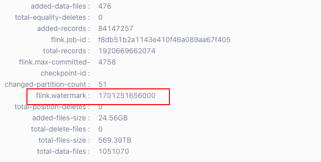
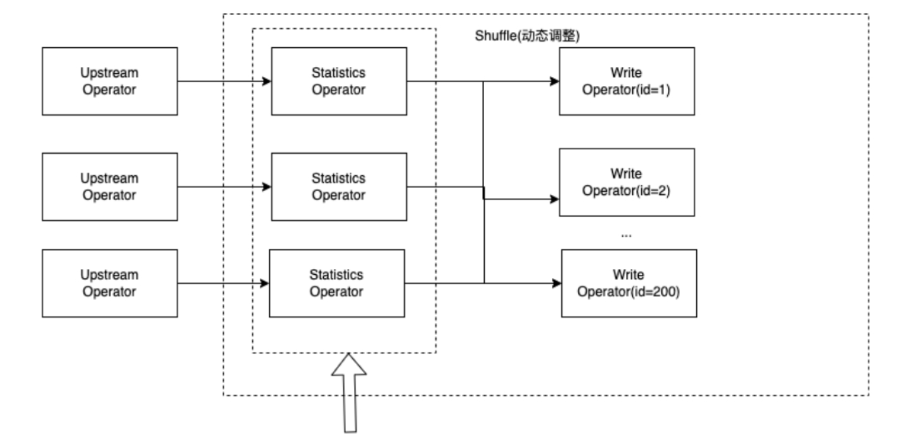
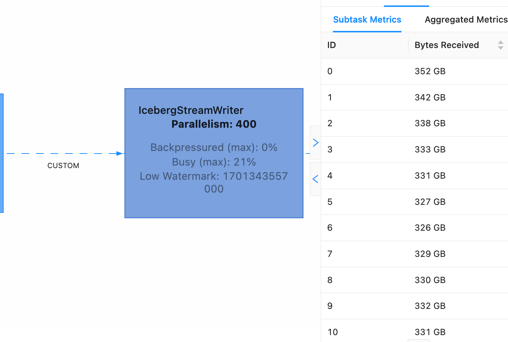

# 摘要

本文主要介绍了虎牙基于 Apache Iceberg 以及 Amoro 在数据湖构建方面的实践经验。

[[一段话介绍虎牙情况]]

本文将主要介绍虎牙基于 Apache Iceberg 在实时报表/Adhoc查询和离线链路实效性提升两个场景下的实践。

# 实时报表/Adhoc查询场景

  
1. **基于 Apache Iceberg 构建实时分析数仓的背景**

虎牙通过数据分析平台提供面向数据分析师的 Trino SQL 查询服务，以满足BI报表或Adhoc查询的需求。 
分析师在使用数据前需要将数据源注册到数据分析平台，通常是来自日志采集平台的产生的某个 Kafka Topic, 
然后数据分析平台会自动维护一个 Flink 传输任务将数据导入对 Trino 查询的存储系统中。

在接入 Iceberg 之前，对于实时性要求不高的情况通常是使用 Hive ，而对于实效性要求比较高的场景，会使用 Clickhouse 集群作为实时数仓。

不过在实际生产环境下使用 Clickhouse 作为实时数仓并不能满足虎牙近实时分析的需求，主要是因为在实时分析场景中，源端表一般都是明细表，数据量非常庞大，而对于 Clickhouse 这种存储计算一体的架构，在遇到大表的访问时，很容易出现集群不可用。甚至可能因为某个分析师执行了一个大SQL，导致整个集群的实时数据入仓出现问题。

为了提升可用性，虎牙决定使用基于数据湖技术，构建存算分离架构的实时分析数仓。在众多数据湖方案中，虎牙最终选择了 Apache Iceberg, 在使用存算分离的架构后，系统整体的稳定性得到了比较好的提升，不再会出现因为某个查询SQL而导致数据无法入湖的情况发生。


2. **利用 Doris 对热点数据加速**

虽然 Apache Iceberg 带来了稳定性上的提升，但是对于报表或分析场景，查询的响应速度也很关键。由于分享场景大多都是日志数据，热点数据集中在最近几个分区，在这种业务场景下，虎牙数据分析平台提供了基于 Doris 的热点数据查询加速的能力。

上游数据在入湖过程中，Flink 入湖任务也会同步的将数据写入 Doris 引擎中，然而与之前直接使用 CK 做查询引擎不同，这里引入 Doris 只会将数据保留较短的时间，并且会周期性的淘汰比较久远的信息。同时 Flink 任务会在每个分区完成时生成 PartitionEvent 并同步到虎牙自研的元数据服务。元数据服务中记录了 Doris 中保留的热点数据的分区信息。


同时改写了 Trino 查询引擎的执行计划，用户查询时会先访问元数据服务，拿到对应的表在 Doris 和 Iceberg 的分析信息，通过物化查询器的重写，将最近一段时间的插件直接命中 Doris ， 对于 Doris 中已经删除的分区会命中到 Iceberg 表上。这样对于近实时的查询可以获得更好的查询性能。

3. **重新 FileIO 进行 alluxio加速**

通过引入 Doris 解决了大部分较近数据的查询响应需求，然而仍然有部分对查询需求要求 Iceberg 表也有较高的查询响应需求。对于这部分表，数据分析平台自己搭建了 Alluxio 集群对查询进行加速。

由于 Alluxio 集群只在查询加速时才开启，所以并没有使用 Hadoop 集成 Alluxio 的方式使用，对于数据入湖过程中，仍然以 `hdfs://` 的文件路径写入数据文件。为了可以根据需求动态的选择 Alluxio 查询加速，虎牙在 Trino 的 Iceberg FileIO 进行了封装，通过表上的参数，在读取文件时将文件路径重定向到 Alluxio 集群。

```sql
alter table iceberg.xxx.xxx set tblproperties (
    'read.datafile.alluxio.enable' = 'true');
```

这样 Trino 引擎就可以根据需要选择访问 Hadoop 或 Alluxio 集群访问数据文件了。

通过以上两种方式对 Iceberg 表的查询加速，几乎获得了和 OLAP 引擎接近的查询体验。


# 离线链路时效提升

1. 业务背景

虎牙的批处理链路是基于 Hive + Spark 的方案，采用的是小时级的分区以提升离线计算的实效性，然而这套方案还是存在一些问题：

1. 对 Hive Meta Database 压力大: 由于是小时级分区，导致分区数量非常庞大，在分区数比较多的查询中对 MySQL 服务的压力很大，对系统整体的可用性会带来较大的风险。
2. 没有 File Skippping 能力: Hive 只能做到分区级别的文件过滤，实际查询中还是会读取很多不需要的文件，对整体计算任务的性能影响比较大。
3. 任务调度困难: 为了提高计算的实效性，我们期望数据到达后立即调度，但是 Hive 目前的元数据很难支持判定一个分区的数据是否全部到达。
4. 实效性达不到要求: 由于调度触发以及计算性能的问题，即使使用了小时级别的分区，后续的分析任务执行完成时，延迟已经超过1小时很久了。

上述问题的核心还是实效性，虎牙通过将 ODS/DWD 层从 Hive 表替换为 Iceberg 表以解决上述问题。在替换为 Iceberg 表以后，虎牙将任务调度的周期从1小时一次改为了10分钟一次。

由于 Iceberg 有很强的 File Skipping 能力，而且通过时间过滤后，每次参与计算的文件数量大大减少了，这不仅提高了计算效率，并且由于调度周期的提升，使得最终产出数据的实效性得到了提升。

另外通过对 Flink Iceberg Sink 进行改造，使得每次提交时，将当前数据的 watermark 记录到 Snapshot sammary 中.



这样任务调度系统即可依据 SQL 查询 Iceberg 元数据表决定是否开始进行计算任务的调度。

```sql
SELECT 
assert_true(date_format(from_unixtime(max(summary['flink.watermark'])/1000),'yyyy-MM-dd HH:mm:ss') > 'xxx')
FROM iceberg.xxx.xxx.snapshots;
```
 

# Iceberg 使用过程中的优化

**1. Flink 写入过程中数据倾斜问题处理**

在以上两个使用 Iceberg 的场景中，均使用 Flink 完成数据入湖。在使用 Flink 写入 Iceberg 的过程中，由于源端数据分布问题，导致出数据倾斜。

比如在表中定义三个分区字段 `day` `hour` 和 `type`， 通过 Flink 实时写入 Iceberg ， Iceberg 提供 `distribution-mode` 为 `none` 或者 `hash`，如果是 `none` 的话在`flink`到 `writer` 是散发过去的，每个 `writer` 都会至少生成 `type` 总类型数量文件，如果 `type` 一共有50种，写入并行度为200，那么在一次checkpoint中至少生成 50 * 200 个文件，这会导致产生非常多的 io 链接，commit的时候也不稳定。如果使用`hash`，可以减少文件的生成，但是如果某一个 `type` 的值特别大，就会导致这个`type` 值全部发往一个writer，这样就会导致数据倾斜,在写入的时候吞吐量就不够了，而且会有严重的反压。


虎牙的解决方案是通过 在 `Flink writer` 算子之前添加一个统计算子以及 `Custom Partition` 实现的。 


通过对 `flink RowData` 做一层包装, 在数据中加入自定义的分区号：

```java
public class RowDataWrap implements RowData {
  private RowData rowData;
  private int partition;

  public RowData getRowData() {
    return rowData;
  }

  public RowDataWrap setRowData(RowData rowData) {
    this.rowData = rowData;
    return this;
  }

  public int getPartition() {
    return partition;
  }

  public RowDataWrap setPartition(int partition) {
    this.partition = partition;
    return this;
  }
```

在 `Flink writer` 算子之前添加一个统计算子用于收集本次 `checkpoint` 中各个 `type` 类型所占此区间内的比例, 在 checkpoint 之后作为算子状态存储，比如:


```
type_a:12%, type_b:30%, type_c:0.5%.....
```


然后在下一个checkpoint区间，再计算出行数据需要发往的 `partition num`，比如上述如果有200个写入并行度，那么 `type_a` 的数据就会被发送到 `0~23` 号写入 partition 写入。




最终能在既能保证写入效率的情况下，文件数量也能控制在一个合理值。




如图，每个写入task的写入数据量都几乎相等，这解决了日志入湖场景下的大难题，有了type分区，下游也能更好的利用 `iceberg` 的 `file skipping` 能力.

当然 Iceberg 社区也有一个 project 在跟进这块 ，有兴趣也可以关注一下： <https://github.com/apache/iceberg/projects/27>

####


# 未来规划
